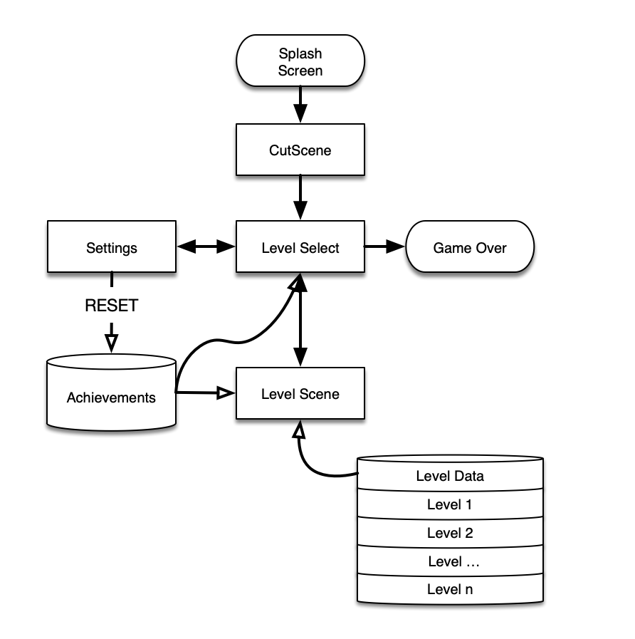
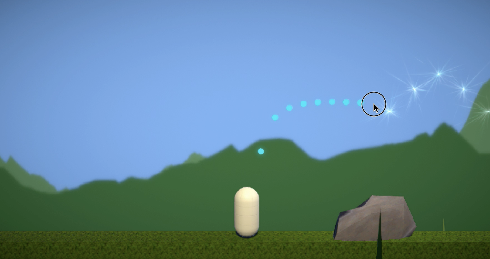
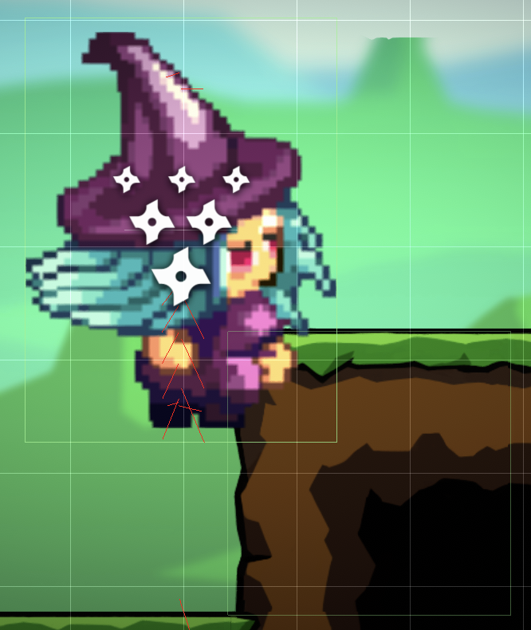

# Starcatcher Nyx

This game is the [final project](https://cs50.harvard.edu/games/2018/projects/final/final/) submitted in partial fulfilment of the requirements for [CS50G: Introduction to Game Development](https://www.edx.org/course/cs50s-introduction-to-game-development) offered by EDx/HarvardX.

### Premise

You are Nyx, a Starcatcher in training, whose job is to bring about night by catching stars as quickly as you can. Will you catch enough in time to please your mother the Moon and gain special abilities along the way?

Combining simple screen-tap game mechanics with attractive light and landscapes makes this a casual, family-friendly game that is both relaxing and exciting to play.

Tap fast. Grab stars. Become the next Starcatcher.

You can do it, Nyx.

[More about the game and beta testing programme](https://www.robertpeake.com/games/starcatcher-nyx)

### Demo

### Game States

The game begins with a logo **Splash Screen** as per the build settings in Unity, then loads the **CutScene** with an animation explaining the premise of the game. This then transitions to the **LevelSelect** screen, giving an overview of achievements so far (stars captured and powerups unlocked) with an option to switch to the **Settings** scene or select the first level.

Choosing a level takes the player to the **LevelScene** and sets a level parameter in the persistent LevelManager object. This allows all other objects in the LevelScene to access data stored as public variables in instances of the LevelData class through the LevelManager as a broker for these data.

This includes:

 - All visual elements of the level, including scenery, parallax background, and tiles in use
 - Probabilities for tiles that dictate the degree of undulation of the terrain
 - Information supplied to the PowerupDropper that dictates how frequently powerups are dropped
 - Information supplied to the StarDropper that dictates how frequently stars are dropped
 - Information supplied to the DisplayManager to draw the in-game achievements panel

From the LevelScene, a user can pause and exit back to LevelSelect. Upon level completion, achievements are updated and animations show the user the results of their achievements, including unlocking powerups, unlocking access to the next level, and approbation.

Achievements are stored in a static Achievements class managed by the ubiquitous LevelManager, which is serialized and saved out as JSON data so that achievements persist between sessions when the game is closed and re-opened.

The Settings scene, accessed from LevelSelect, currently has one button, which allows you to reset your achievements in aid of beta testing.

The game currently has four levels; upon unlocking the fifth level and attempting to play it, the GameOver state is presented, thanking the tester for beta testing and providing a link to a feedback form.

As is standard with mobile games, there is no "exit" button, the user simply double-taps the home screen and swipes up to exit the app.

### Game Goals and Progression

The game provides both level-specific and game-specific goals, both of which revolve around tapping the screen in the optimal timing to collect stars.

 1. **Level-specific goal:** gather enough stars within the alloted time for the level to surpass the "half-moon" marker and unlock the next level
 2. **Game-specific goal:** gather enough stars cumulatively over time by playing multiple levels in order to unlock powerups that enhance the abilities of the in-game avatar

Users will invariably gain skill in collecting more stars within a fixed timeframe as they continue to play the game. In addition, by persisting in gameplay to unlock powerups, these will also aid them in overcoming progressively more challenging levels. Providing multiple paths to progression (upskilling or grinding) is a deliberate attempt to keep players challenged but not frustrated.

### Game Development and Design

Getting to the beta testing stage for this game has involved an estimated **200 hours of development time** resulting in **4,700 lines of custom code**. Furthermore, there were several "pivots" away from previous design concepts into the present state.

#### Evolution of Concept

I wanted to make a game that would appeal to a wide range of players, not just "hardcore" gamers, and explore the unique challenges of designing a game for mobile phones. 

**Original concept:** "Star Run" - you are a horse who collects stars and avoids enemies in an endless runner. Powerups change you into a pegasus (allowing you to fly) or unicorn (allowing you to shoot your horn at enemies) -- all of which, like jumping, is controlled simply by tapping anywhere on the screen.

However, as I researched the feasibility of animating plausible horse jumps, I soon realised that their sheer length makes them cumbersome for games involving fast or rhythmic jumping. This is why games like Geometry Dash have a simple, compact avatar.

**Next concept:** "Dusk Run": A humanoid avatar collecting stars arranged in long arcs. The mechanic here was tap-and-hold, position arc guide, and release to jump, much like Angry Birds. Unfortunately, this "launch" mechanic just didn't work well in real-time for an infinite scroller game. Pausing before launch also felt clunky.

**Finally**, I settled on a humanoid avatar jumping and "flapping" through arcs of stars. The lighting effects were to be central to the theme--a progression from day to night brought about by the avatar collecting the stars. At first, I chose a full 3D environment to create a 2.5D scroller, thinking the 3D lighting effects were essential. I soon discovered there was little benefit and many challenges to escape the uncanny valley with this approach, and switched to a true 2D environment with parallax scrolling and a more cartoon-like feel.

### Unique Challenges

The single greatest challenge with this kind of game was creating indefinite forward movement, and handling collisions in a plausible way that impeded this movement in a controllable way. Simply using the built-in Unity physics model was not an option, as Dynamic bodies would "bounce all over the place", respond to friction, etc.

#### The Illusion of Movement

Instead, I opted for an avatar essentialy fixed in the X direction, with a world that scrolled from right to left around her, giving the illusion that she was moving from left to right. To achieve this, I used a Kinematic rigidbody and box collider for the avatar, and box colliders on the relevant (surface) ground tiles.

Implementing a fixed jump height with custom gravity was relatively straightforward using formulae from Newtonian physics.

#### Collision Detection

However, it took considerable effort to get collision detection right, and in particular solving a classic "corner case" for box colliders. Whenever the avatar box collider was travelling at high speed, there was a risk that the boxes would overlap on the very next frame, making a raycast in either the horizontal or vertical direction "miss" due to having surpassed the boundary line, causing the avatar to sink through the ground.

The strategies I employed to prevent this included:

 - Implementing terminal velocity (i.e. clamping downward velocity for falls from great height)
 - Extrapolating forward based on angular velocity
 - Raycasting at 45 degrees downward based on this extrapolation
 - Implementing a secondary spherical collider at the join between ground tiles as a safeguard

This was a lot of work, involving careful testing to ensure the avatar stayed on the ground despite considerable bouncing and jumping.

#### Bouncing and Recovering

Another challenge with the custom physics was implementing "bouncing". Since the avatar was essentially fixed in the x direction, this meant having all other world elements move in relation to the speed of the avatar, which flipped from positive to negative at time of bounce and then gradually "reovered" back to full positive speed.

#### StarDropper Concept

One major advantage of implementing the physics myself was that I was able to create a StarDropper entitiy that inherited all basic features from a common class shared with the player avatar, and thereby could impose all of the same physics constraints and attributes on this star dropper as on the avatar.

This meant that stars could be laid out ahead of the player avatar in a manner that was entirely collectible given the current state of the avatar--because the dropper was behaving in a manner congruent with what was possible for the avatar. This proved to be essential to making the gameplay work when the avatar attributes changed, for example being able to jump higher or move faster due to a powerup--because the star dropper would then drop higher, steeper, or longer arcs of stars as appropriate, which would match the avatar's present capabilities.

#### Object Pooling

At any one time, the game could involve 500+ game tiles and an equal number of stars. As a result, simply spawning prefabs and destroying them once past the boundary caused considerable performance problems. I therefore had to implement an ObjectRecycler that would retain pointers to deactivated game objects and serve them back up to the WorldBuilder when requested. Objects could take different sub-types (e.g. a ground tile could be a middle, corner, etc.) and so this involved indexing pointers to the deactivated objects in multiple dimensions.

For tidiness, I also parented these pooled objects appropriately to keep the Hierarchy manageable during test plays.

Because the StarDropper implemented "AI" logic to be able to jump over obstacles, I could also apply this logic to the player avatar to create an "autopilot" mode that proved invaluable for testing. I would run the game with the avatar on "autopilot" overnight to ensure that a) the avatar never fell through the floor and b) object pool recycling meant that the game operated within a fixed memory space. It was a great feeling to see that a level could be run for many hours, even if the actual game levels would only run for three minutes.

### Third Party Libraries

I used a few third-party libraries to provide visual interst to the game:

 - [Simple 2D Background Pack](https://assetstore.unity.com/packages/2d/environments/simple-2d-background-pack-179115) and [2D Platformer Tileset](https://assetstore.unity.com/packages/2d/environments/2d-platformer-tileset-173155) by Daniel Chernyaev - these provided parallax backgrounds and tiles and decorative elements for the game

 - [GUI PRO Kit - Casual Game](https://assetstore.unity.com/packages/2d/gui/gui-pro-kit-casual-game-176695) by Layer Lab - this provided UI elements such as buttons and sliders

 - [Particle Pack](https://kenney.nl/assets/particle-pack) by kenney.nl - these provided some particle effects

 - [DOTween Pro](https://assetstore.unity.com/packages/tools/visual-scripting/dotween-pro-32416) by Demigiant - this provided both programmatic and component-based access to tween effects (motion, fade, etc.) and saved a lot of time "lerping" chained effects to create animation sequences (though for simple transitions I still did use lerp/pingpong/etc.)

 - The Nyx avatar herself was based on a design by [PixelABCD](http://armortale.rpg2heaven.com/) and released into the public domain

### Beta Testing and Next Steps

The game is currently in [beta testing](https://www.robertpeake.com/games/starcatcher-nyx/testing), and I welcome new testers. Many features are left to implement:

 - Sound, including soundtrack (my wife is a composer), voice acting for cutscenes, and sound effects
 - Artwork from a single artist with a more unified feel
 - The ability to save and deploy powerups, leading to stockpiling and strategy for combining powerups to achieve better outcomes in collecting stars
 - Adversaries, such as rolling boulders or flying birds, which drain the avatar of flying points and negate powerups
 - More powerups, including immunity to adversaries and greater reach to collect stars on screen
 - More cutscenes, including featuring Nyx's cat, Osiris, who acts as a guide and gives hints about gameplay
 - More particle effects, animations, and secondary motion effects to provide "juice" to the game
 - Improved lighting effects to provide atmosphere, and atmosphere elements (snow, etc.) unique to each level
 - Approbation during "streaks" of collection
 - Balancing and tuning to get the challenge right for each level

With this in place, along with any suggestions from the beta testing group, the intention will be to release this game to the Apple App Store.

### Conclusion and Thanks

This has been a huge effort, but would not have been possible without the amazing open courseware content from CS50G. I am realising a childhood dream making video games thanks to the generosity of HarvardX and everyone involved. Thank you.
